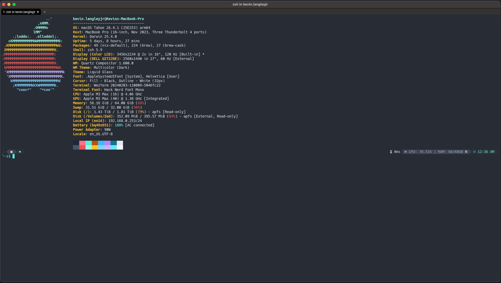

<div align="center">


<picture>
  <source media="(prefers-color-scheme: dark)" srcset="https://getslatewave.com/brand/wordmark-light.png">
  
</picture>

# Slatewave (WezTerm)

A Slatewave theme for [WezTerm](https://wezterm.org) — slate foundation, teal signature. Part of the [Slatewave family](#slatewave-family) — one palette across editors, terminals, prompts, notes, and more.

> _Slate below, teal above._



</div>

---

## What it styles

Slatewave for WezTerm ships as three files. Pick whichever fits your config style:

- **`slatewave.toml`** — drop-in color scheme. Goes into `~/.config/wezterm/colors/` and gets picked up by name. Covers the palette, ANSI, cursor, selection, copy-mode highlights, quick-select hints, and the tab bar.
- **`slatewave.lua`** — the same palette as a Lua table, for users who'd rather register the scheme inline via `config.color_schemes` instead of managing a separate TOML.
- **`slatewave-full.lua`** — palette + opinionated typography. Registers the Slatewave scheme, then layers Hack Nerd Font Mono at 14pt, a non-blinking block cursor, and a fully opaque, unblurred window. Use this if you want the whole Slatewave house style in one `require`.

The scheme itself is tuned against WezTerm's full color schema — not just the 16 ANSI colors. It sets:

- **ANSI 0–15** — mirrored from the VSCode Slatewave terminal block so `ls --color`, `git diff`, and 256-color TUIs all read identically across your editor and terminal
- **Background** — slate `#282c34`, matching the VSCode editor background
- **Foreground** — slate-200 `#e2e8f0`, matching the VSCode editor foreground
- **Cursor** — teal `#5eead4` with slate-background text, so the block cursor stays legible
- **Compose cursor** — amber `#fbbf24`, distinguishable from the regular cursor while typing dead keys
- **Selection** — slate-700 `#334155` with slate-200 text, for a calm, non-competing highlight
- **Copy mode** — sky `#38bdf8` for inactive matches, teal `#5eead4` for the active match (mirrors VSCode's `findMatchHighlight` / `findMatch` split)
- **Quick-select hints** — amber `#fbbf24` leader on amber-700 `#b45309` tail, for the hint overlay
- **Tab bar** — chrome `#21252b` background matching the VSCode activity bar, with a slate-700 edge between inactive tabs
- **Scrollbar** — slate-600 `#475569` thumb for a subtle, non-distracting indicator

---

## Installation

### Color scheme only (`slatewave.toml`)

WezTerm auto-loads any `*.toml` file in `$XDG_CONFIG_HOME/wezterm/colors/` as a named color scheme. The `[metadata]` block inside the file sets the scheme name — Slatewave registers as `"Slatewave"`.

```sh
mkdir -p ~/.config/wezterm/colors
curl -fsSL https://raw.githubusercontent.com/kevinlangleyjr/wezterm-slatewave/main/slatewave.toml \
  -o ~/.config/wezterm/colors/slatewave.toml
```

Then in your `~/.config/wezterm/wezterm.lua`:

```lua
local wezterm = require 'wezterm'
local config  = wezterm.config_builder()

config.color_scheme = 'Slatewave'

return config
```

### Color scheme only (`slatewave.lua`, inline)

If you'd rather not manage a separate TOML, use the Lua table instead. Drop `slatewave.lua` next to your `wezterm.lua`:

```sh
curl -fsSL https://raw.githubusercontent.com/kevinlangleyjr/wezterm-slatewave/main/slatewave.lua \
  -o ~/.config/wezterm/slatewave.lua
```

Then register the scheme inline:

```lua
local wezterm = require 'wezterm'
local config  = wezterm.config_builder()

config.color_schemes = { Slatewave = require 'slatewave' }
config.color_scheme  = 'Slatewave'

return config
```

### Palette + typography (`slatewave-full.lua`)

The full bundle is a self-contained Lua module — it registers the Slatewave scheme inline and layers font, cursor, and window defaults. Requires [Hack Nerd Font](https://www.nerdfonts.com/font-downloads) — specifically the Mono variant, so Nerd icons stay single-cell in `lazygit`, `btop`, and `ls`.

```sh
curl -fsSL https://raw.githubusercontent.com/kevinlangleyjr/wezterm-slatewave/main/slatewave-full.lua \
  -o ~/.config/wezterm/slatewave-full.lua
curl -fsSL https://raw.githubusercontent.com/kevinlangleyjr/wezterm-slatewave/main/slatewave.lua \
  -o ~/.config/wezterm/slatewave.lua
```

Then in `~/.config/wezterm/wezterm.lua`:

```lua
local wezterm = require 'wezterm'
local config  = wezterm.config_builder()

require('slatewave-full').apply_to_config(config)

return config
```

Override individual defaults after `apply_to_config` — later assignments win, so you can keep the palette and replace just the font, for example:

```lua
require('slatewave-full').apply_to_config(config)

-- keep the Slatewave palette, swap in a different font
config.font      = wezterm.font 'JetBrainsMono Nerd Font'
config.font_size = 13.0
```

### From a local clone

```sh
git clone https://github.com/kevinlangleyjr/wezterm-slatewave
cp wezterm-slatewave/slatewave.toml      ~/.config/wezterm/colors/
cp wezterm-slatewave/slatewave.lua       ~/.config/wezterm/          # optional
cp wezterm-slatewave/slatewave-full.lua  ~/.config/wezterm/          # optional
```

---

## Palette

Slatewave shares its palette with the companion themes. The anchor colors:

| | Hex | Tailwind | Role |
|---|---|---|---|
|  | `#282c34` | — | **background** |
|  | `#21252b` | — | tab bar background, split line |
|  | `#334155` | slate-700 | selection background, inactive tab edge |
|  | `#1e293b` | slate-800 | ANSI 0 (black) |
|  | `#475569` | slate-600 | scrollbar thumb, ANSI 8 (bright black) |
|  | `#e2e8f0` | slate-200 | **foreground**, ANSI 7 (white) |
|  | `#5eead4` | teal-300 | **cursor, active copy-mode match**, ANSI 2 (green) |
|  | `#99f6e4` | teal-200 | ANSI 10 (bright green) |
|  | `#7dd3fc` | sky-300 | ANSI 12 (bright blue) |
|  | `#38bdf8` | sky-400 | **inactive copy-mode match**, ANSI 4 (blue) |
|  | `#b388ff` | — | ANSI 5 (magenta) |
|  | `#fb7185` | rose-400 | ANSI 1 (red) |
|  | `#fbbf24` | amber-400 | **compose cursor, quick-select label**, ANSI 11 (bright yellow) |

### ANSI mapping

Mirrors the `terminal.ansi*` block from [vscode-slatewave](https://github.com/kevinlangleyjr/vscode-slatewave/blob/main/themes/slatewave-color-theme.json) so shell output is consistent across editor and terminal.

| Slot | Normal | Bright |
|---|---|---|
| Black | `#1e293b` slate-800 | `#475569` slate-600 |
| Red | `#fb7185` rose-400 | `#ef5350` |
| Green | `#5eead4` teal-300 | `#99f6e4` teal-200 |
| Yellow | `#b45309` amber-700 | `#fbbf24` amber-400 |
| Blue | `#38bdf8` sky-400 | `#7dd3fc` sky-300 |
| Magenta | `#b388ff` | `#c4b5fd` violet-300 |
| Cyan | `#0e7490` cyan-700 | `#67e8f9` cyan-300 |
| White | `#e2e8f0` slate-200 | `#f1f5f9` slate-100 |

---

## Customize

Every value in `slatewave.lua` is a plain Lua string; override individual entries without forking by registering your own scheme table that extends Slatewave:

```lua
local slatewave = require 'slatewave'

-- Swap just the cursor to teal-200 while keeping everything else
local custom = setmetatable({
  cursor_bg     = '#99f6e4',
  cursor_border = '#99f6e4',
}, { __index = slatewave })

config.color_schemes = { Slatewave = custom }
config.color_scheme  = 'Slatewave'
```

For the TOML route, copy `slatewave.toml` to a new name under `~/.config/wezterm/colors/`, change `[metadata].name`, and edit in place — WezTerm will pick it up on next reload.

---

## Slatewave family

One palette. Every tool.

- **Editors** — [VSCode](https://github.com/kevinlangleyjr/vscode-slatewave) · [JetBrains](https://github.com/kevinlangleyjr/jetbrains-slatewave) · [Xcode](https://github.com/kevinlangleyjr/xcode-slatewave) · [Sublime Text](https://github.com/kevinlangleyjr/sublime-text-slatewave) · [Zed](https://github.com/kevinlangleyjr/zed-slatewave) · [Neovim](https://github.com/kevinlangleyjr/neovim-slatewave) · [Helix](https://github.com/kevinlangleyjr/helix-slatewave)
- **Terminals** — [Alacritty](https://github.com/kevinlangleyjr/alacritty-slatewave) · [Ghostty](https://github.com/kevinlangleyjr/ghostty-slatewave) · [iTerm2](https://github.com/kevinlangleyjr/iterm2-slatewave) · [Windows Terminal](https://github.com/kevinlangleyjr/windows-terminal-slatewave) · [Kitty](https://github.com/kevinlangleyjr/kitty-slatewave)
- **Prompts** — [Oh My Posh](https://github.com/kevinlangleyjr/slatewave-omp) · [Powerlevel10k](https://github.com/kevinlangleyjr/p10k-slatewave) · [Starship](https://github.com/kevinlangleyjr/starship-slatewave)
- **Multiplexer** — [tmux](https://github.com/kevinlangleyjr/tmux-slatewave)
- **CLI** — [bat](https://github.com/kevinlangleyjr/bat-slatewave) · [delta](https://github.com/kevinlangleyjr/delta-slatewave) · [LSD](https://github.com/kevinlangleyjr/lsd-slatewave) · [btop](https://github.com/kevinlangleyjr/btop-slatewave)
- **Notes** — [Obsidian](https://github.com/kevinlangleyjr/obsidian-slatewave) · [Logseq](https://github.com/kevinlangleyjr/logseq-slatewave) · [MarkEdit](https://github.com/kevinlangleyjr/markedit-slatewave) · [Anytype](https://github.com/kevinlangleyjr/anytype-slatewave)
- **Launchers** — [Alfred](https://github.com/kevinlangleyjr/alfred-slatewave) · [Raycast](https://github.com/kevinlangleyjr/raycast-slatewave)
- **Chat** — [Slack](https://github.com/kevinlangleyjr/slack-slatewave)

See [getslatewave.com](https://getslatewave.com) for the full family.
---

## Contributing

Issues and PRs welcome. For palette changes, include a before/after screenshot of the same terminal session (`ls --color`, `git diff`, a TUI like `lazygit` or `btop`) so the visual tradeoff is obvious.

---

## License

WTFPL — Do What The Fuck You Want To Public License. See [LICENSE](LICENSE).
